# Velocity.new - Pure Vibes

> **Code at the speed of thought with advanced precision.**


**Velocity.new** is a cutting-edge AI-powered code generation platform that transforms natural language queries into complete, production-ready web and mobile applications. Built with advanced precision and modern architecture, it delivers fully functional React and Flutter applications through an intelligent multi-stage pipeline.

## 🚀 Key Features

- **🎯 Natural Language to Code**: Transform simple descriptions into complex applications
- **🔄 Multi-Stage Pipeline**: Sophisticated context gathering and code generation workflow
- **⚡ Parallel Processing**: Concurrent execution for maximum efficiency
- **🎨 Intelligent Design**: Automated theme and component architecture
- **🔧 IDE Agent**: Advanced debugging and modification tools
- **📱 Cross-Platform**: Support for both React and Flutter applications
- **🛠️ Heuristic Routes**: Smart route generation based on project structure
- **✅ Build Validation**: Automatic error detection and resolution

## 📊 System Architecture

### Context Gathering Pipeline



Our intelligent 5-stage context gathering system analyzes user requirements and builds comprehensive application specifications:

**Stage I**: Screen Analysis & Selection
- Natural language query processing
- Screen identification and categorization
- User-driven selection interface

**Stage II**: Requirements Analysis
- Detailed screen specifications
- User journey mapping
- Data requirements identification

**Stage III**: Parallel Design Analysis
- **III-A**: Theme & Design System generation
- **III-B**: Component architecture planning
- Concurrent execution for efficiency

**Stage IV**: Screen Context Collection
- Individual screen specifications
- Component usage patterns
- Layout and interaction details

**Stage V**: Navigation Context
- Inter-screen navigation patterns
- User flow optimization
- Routing specifications

### Code Generation Pipeline


#### React Applications
1. **Stage I**: Tailwind CSS theme generation
2. **Stage II**: Global component ecosystem (parallel)
3. **Stage III**: Screen-specific code generation (parallel)
4. **Stage IV**: Heuristic routes generation
5. **Stage V**: Build validation and error checking

#### Flutter Applications
1. **Stage I**: Flutter theme and Material Design system
2. **Stage II**: Screen-specific code generation (parallel)
3. **Stage III**: Heuristic routes generation
4. **Build Validation**: Automated testing and error detection

## 🏗️ Technical Architecture

### Backend Services
- **FastAPI Framework**: High-performance async API
- **Multi-Service Architecture**: Separate services for different concerns
- **Session Management**: Persistent context across requests

### Frontend Interface
- **React 18**: Modern frontend with workflow management
- **Interactive UI**: User-friendly selection and configuration

### AI Integration
- **Anthropic Claude**: Advanced language model integration
- **Structured Prompts**: Specialized prompts for each generation stage
- **Context Optimization**: Efficient token usage and context management

## 🛠️ IDE Agent Tools

The IDE Agent provides 10 powerful tools for post-generation support:

### File Access Tools
- **File Reader**: Read and analyze code files
- **File Search**: Fuzzy search across project files
- **Directory Listing**: Project structure exploration
- **File Deletion**: Safe file removal with validation

### Modification Tools
- **Edit File**: Intelligent code editing with Relace API
- **Search & Replace**: Advanced pattern-based replacements
- **Code Refactoring**: Automated code improvements

### Search Tools
- **Grep Search**: Advanced pattern matching with exclusions

### Environment Tools
- **Terminal Commands**: Safe command execution with security checks

### Utility Tools
- **Exit Tool**: Session summary and cleanup


## 🔧 Installation & Setup

### Prerequisites
- Python 3.8+
- Node.js 16+
- Flutter SDK (for Flutter projects) 

#### **Required Tools**
```bash
# macOS
brew install ripgrep fzf

# Ubuntu/Debian
sudo apt install ripgrep fzf

# Windows (using winget)
winget install BurntSushi.ripgrep fzf
```


#### **External Services**
- **MongoDB**: Local instance or MongoDB Atlas
- **Anthropic**: Claude API access
- **Relace**: Relace API key for code apply 

### **Step-by-Step Installation**

#### **1. Clone and Setup Backend**
```bash
# Clone the repository
git clone https://gitlab.dhiwise.com/internship_program_2025/group-project-2/rocket-code-generation.git
cd rocket-code-generation

# Setup Python environment
python -m venv .venv
source .venv/bin/activate  # Windows: .venv\Scripts\activate

# Install dependencies
pip install -r requirements.txt
```

#### **2. Configure Environment Variables**

- Create `.env` in the root directory following `.env.example`
- Create `.env` in the `system/backend/agentic_workflow` directory following `.env.example`

### Backend Setup
```bash
# Install dependencies
pip install -r requirements.txt

# Start the main workflow service
uvicorn system.backend.agentic_workflow.main:app

# Start the tools service
uvicorn system.backend.tools.main:app --port 8001  
```

### Frontend Setup
```bash
# Install dependencies
cd system/frontend
npm install

# Start the development server
npm start
```

#### Common Issues & Solutions

##### ImportError: cannot import name 'SON' from 'bson'

If you encounter this error while installing dependencies:
```
ImportError: cannot import name 'SON' from 'bson' (/Users/krish/.pyenv/versions/3.10.2/lib/python3.10/site-packages/bson/__init__.py)
```

Run the following commands to fix it:
```
pip uninstall bson
pip install --force-reinstall pymongo
```

## 🚀 Usage

### 1. Initial Processing
Start by describing your application:
```
"Build a habit tracker that visualizes me daily routines as evolving star constellations. Each completed habit adds a star, creating beautiful patterns that represent my personal growth journey"
```

### 2. Screen Selection
Review and select from automatically identified screens:
- Constellation Home
- Habit Management
- Progress Galaxy
- Daily Ritual
- Constellation Library

### 3. Code Generation
Choose your platform (React/Flutter) and let the AI generate your complete application.

### 4. Error Resolution
If build errors occur, the IDE Agent automatically:
- Identifies the root cause
- Suggests fixes
- Applies corrections
- Validates the solution

### 5. Modifications
Use the IDE Agent tools to:
- Add new features
- Modify existing screens
- Debug issues
- Optimize performance

## 🎯 Supported Patterns

### React Applications
- **Modern React 18**: Hooks, functional components, and concurrent features
- **Tailwind CSS**: Utility-first styling with custom design systems
- **React Router**: Client-side routing with modern patterns
- **State Management**: Local state and Context API integration
- **Responsive Design**: Mobile-first, adaptive layouts

### Flutter Applications
- **Material Design 3**: Latest design system implementation
- **Cross-Platform**: iOS and Android support
- **State Management**: Provider pattern and local state
- **Navigation**: Traditional and modern navigation patterns
- **Theming**: Comprehensive theme system with custom extensions

## 📈 Performance Features

### Parallel Processing
- **Concurrent Screen Generation**: Up to 10 screens processed simultaneously
- **Parallel Stage Execution**: Theme and component analysis run concurrently
- **Batch Processing**: Efficient handling of multiple screens

### Global Scratchpad System: The Memory Core

The **Global Scratchpad** is far more than a simple caching mechanism it serves as the **persistent memory system** for the entire code generation pipeline. This sophisticated memory architecture enables:

#### Memory Persistence Across Sessions
- **Context Continuity**: Maintains complete awareness of what has been generated, how it was implemented, and why specific decisions were made
- **Historical Decision Tracking**: Records architectural choices, design patterns used, and component relationships established
- **Incremental Understanding**: Builds upon previous knowledge for follow-up requests and modifications
  
### Error Recovery
- **Automatic Error Detection**: Real-time build validation
- **Intelligent Debugging**: AI-powered error analysis
- **Self-Healing**: Automatic correction of common issues

## 🔄 Workflow Integration

### Development Workflow
1. **Design Phase**: Natural language to specifications
2. **Generation Phase**: AI-powered code creation
3. **Validation Phase**: Automated testing and error detection
4. **Refinement Phase**: IDE Agent improvements
5. **Deployment Phase**: Production-ready output

### Follow-up Requests
- **Incremental Updates**: Add new screens or features
- **Modification Requests**: Edit existing functionality
- **Bug Fixes**: Automated error resolution
- **Performance Optimization**: Code improvement suggestions


## 📚 Approach Documentation

[Approach Documentation](https://grizzly-stargazer-98d.notion.site/Velocity-new-22864f7761058047b4b7e604bafaf92c?source=copy_link)


<div align="center">
  <strong>Built with ❤️ and speed by the team Velocity.new</strong>
  <br>
</div>
